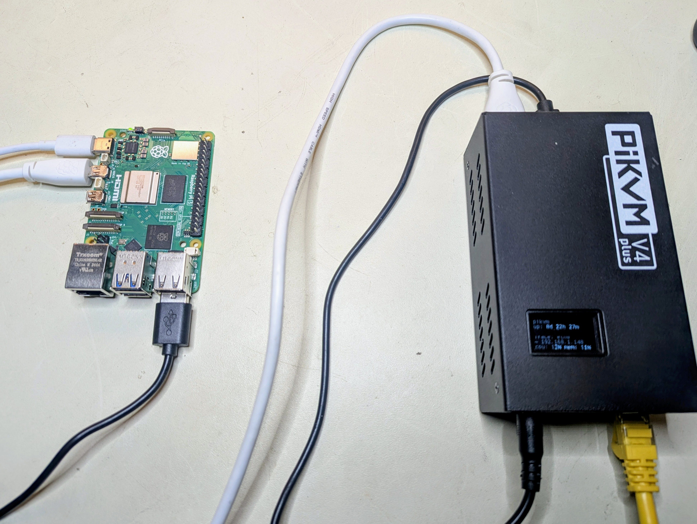

# PiKVM MCP Server


[](https://sonarcloud.io/summary/new_code?id=kultivator-consulting_pikvm_mcp_server)


[](https://lobehub.com/mcp/kultivatorconsulting-pikvm_mcp_server)


Give AI agents hands. This MCP server connects Claude Code (or any MCP client) directly to a [PiKVM](https://pikvm.org/) device, giving AI full keyboard, mouse, and screen access to a physical machine -- no browser automation, no virtual desktops, no emulators.

Point it at real hardware. Let the AI see the screen, type commands, click buttons, and navigate GUIs on a machine it could never otherwise touch.

<p align="center">
  
  <br>
  <em>A Raspberry Pi 5 controlled via PiKVM V4 Plus -- the AI's physical interface to the real world.</em>
</p>

### Automatic Mouse Calibration

IP-KVM devices translate mouse coordinates through multiple layers — USB HID emulation, host-side input drivers, display scaling — each introducing positional error. Existing KVM products either ignore this (requiring manual correction) or offer limited auto-sync that only detects cursor acceleration in a fixed corner region.

This MCP server takes a different approach. The `pikvm_auto_calibrate` tool uses a vision-based algorithm that:

1. **Moves the cursor** a known distance across multiple randomized screen positions
2. **Diffs screenshot pairs** to isolate the cursor via connected-component analysis
3. **Computes correction factors** from detected vs commanded movement using median aggregation
4. **Self-verifies** by moving to target positions and confirming the cursor lands within 20px

The entire process runs in ~30-60 seconds with no human intervention. Noisy screens (tooltips, animations, dynamic content) are handled through multi-round sampling, ratio divergence filtering, and outlier-resistant statistics — the algorithm discards bad data and still converges on accurate factors.

This is the first IP-KVM tooling — commercial or open source — to implement fully automated mouse coordinate calibration via computer vision. It is what makes precise AI-driven mouse control over a network KVM practical.

### See it in action

The video below shows Claude Code using this MCP server to autonomously interact with a Raspberry Pi desktop: taking a screenshot to identify the OS, opening a text editor from the menu, typing text, and closing the application -- all through the PiKVM hardware interface.

[](https://youtu.be/VYE8O1gAs7s)

This next demonstration shows Claude, connected via the PiKVM MCP server, responding to a natural language prompt to auto-calibrate its mouse coordinate scaling before performing a series of precision mouse tasks on a remote machine. The session concludes with Claude autonomously drawing a house in MS Paint — a simple but effective showcase of accurate, AI-driven input control over an isolated system.

[](https://youtu.be/kNj8TJD6odo)

## Features

- **Automatic mouse calibration** — Vision-based cursor detection computes coordinate correction factors with no manual measurement. The first fully automated calibration for IP-KVM.
- **Screenshot capture** — Get current screen as JPEG image
- **Text typing** — Type text with proper special character handling via keymaps
- **Keyboard control** — Send individual keys or key combinations (e.g., Ctrl+Alt+Delete)
- **Mouse control** — Move, click, and scroll with calibrated coordinate correction

## Installation

```bash
npm install
npm run build
```

### Nix / home-manager

A flake at the repo root packages the server reproducibly and exposes a home-manager module (`services.pikvm-mcp`) that installs it, reads the password from a file at runtime, and registers the MCP server in `~/.claude.json` via deep-merge so it coexists with other producers. See [`docs/nix.md`](docs/nix.md) (or [`nix/README.md`](nix/README.md) for the full guide).

## Configuration

Copy `.env.example` to `.env` and configure:

```bash
cp .env.example .env
```

Edit `.env`:
```
PIKVM_HOST=https://<your-pikvm-ip>
PIKVM_USERNAME=admin
PIKVM_PASSWORD=your_password
PIKVM_VERIFY_SSL=false
PIKVM_DEFAULT_KEYMAP=en-us
```

## Usage with Claude Code

> **Requires Node.js 18+.** This server uses ES modules. If `node --version` shows an older version, replace `"command": "node"` with the full path to a compatible binary (e.g. `"/usr/local/bin/node"` or your nvm path like `"~/.nvm/versions/node/v22.x.x/bin/node"`). This is common when nvm's default alias points to an older version.

Add to your Claude Code MCP settings (`~/.config/claude-code/settings.json` or via the settings UI):

```json
{
  "mcpServers": {
    "pikvm": {
      "command": "node",
      "args": ["/path/to/pikvm_mcp_server/dist/index.js"],
      "env": {
        "PIKVM_HOST": "https://<your-pikvm-ip>",
        "PIKVM_USERNAME": "admin",
        "PIKVM_PASSWORD": "your_password"
      }
    }
  }
}
```

Or if using the .env file:

```json
{
  "mcpServers": {
    "pikvm": {
      "command": "node",
      "args": ["/path/to/pikvm_mcp_server/dist/index.js"]
    }
  }
}
```

## Available Tools

### Diagnostics
- **`pikvm_version`** - Return the running server version. Use to detect a stale deployment: query this and compare against `main` (currently `0.5.40`).
- **`pikvm_health_check`** - One-call deployment health: server version + safety-guard state + live HID profile + iPad bounds detection. Run FIRST after deployment; surfaces stale deployments, failed startup detection, and target-type mismatches.

### Display
- **`pikvm_screenshot`** - Capture current screen as JPEG (optional: maxWidth, maxHeight, quality)
- **`pikvm_get_resolution`** - Get screen resolution and valid coordinate ranges

### Keyboard
- **`pikvm_type`** - Type text with keymap-aware special character handling (required: text; optional: keymap, slow, delay)
- **`pikvm_key`** - Send a key or key combo, e.g. Ctrl+Alt+Del (required: key; optional: modifiers, state)
- **`pikvm_shortcut`** - Send multiple keys pressed simultaneously (required: keys array)
- **`pikvm_dismiss_popup`** - Run the hidden-popup dismiss recipe (Escape → 60ms → Enter → 60ms). Useful when `click_at` returns success but the screenshot shows no UI change — the dominant explanation is an iOS HDMI-blocked security popup (Apple Pay / Face ID / password / Low Battery / app permission) eating the input. Live-verified twice on Low Battery modals (10% and 5% — both dismissed cleanly with one Escape). Best-effort, no required args.

### Mouse
- **`pikvm_mouse_move`** - Move cursor to absolute pixel position or relative delta (required: x, y; optional: relative)
- **`pikvm_mouse_click`** - Click a mouse button, optionally at a position (optional: button, x, y, state)
- **`pikvm_mouse_scroll`** - Scroll the mouse wheel (required: deltaY; optional: deltaX)

### Relative-Mouse Targets (iPad, etc. — `mouse.absolute=false`)

> **iPad usage — prefer keyboard workflows.** USB keyboard input on the
> iPad (Cmd+Space for Spotlight, Cmd+F for in-app search, plus typing) is
> far more reliable than cursor clicks because iPadOS pointer acceleration
> is non-disableable. See
> [docs/skills/ipad-keyboard-workflow.md](docs/skills/ipad-keyboard-workflow.md)
> for the recommended pattern. Use the cursor click tools below only for
> UI elements with no keyboard equivalent. iPad-side settings checklist:
> [docs/skills/ipad-setup.md](docs/skills/ipad-setup.md).

- **`pikvm_ipad_unlock`** - Unlock an iPad from lock screen via a USB HID swipe-up gesture. Swipe origin auto-detected from the iPad letterbox bounds (works for portrait and landscape). Optional overrides: slamFirst, startX, startY, dragPx, chunkMickeys.
- **`pikvm_ipad_launch_app`** - Launch any iPad app via the verified keyboard pipeline: unlock (if locked) → Spotlight (Cmd+Space) → type the app name → Enter. Far more reliable than clicking an app icon (required: appName). Verified on iPadOS 26 for Files, Settings, App Store.
- **`pikvm_ipad_home`** - Return the iPad to the home screen from any foreground app via Cmd+H. Idempotent on the home screen.
- **`pikvm_ipad_app_switcher`** - Open the iPad App Switcher (Cmd+Tab) and capture a screenshot showing the available apps.
- **`pikvm_detect_orientation`** - Detect the iPad's content rectangle and orientation within the HDMI capture frame. Used internally by unlock and move-to; usually no need to call directly.
- **`pikvm_mouse_move_to`** - Approximate move-to-pixel on a relative-mouse target. Combines slam-to-origin (auto-detected per orientation), open-loop chunked deltas, motion-as-probe diff for live px/mickey, multi-pass closed-loop correction, and template-match fallback when motion-diff fails (required: x, y).
- **`pikvm_mouse_click_at`** - Approximate move + click on a relative-mouse target (required: x, y; optional: button).
- **`pikvm_measure_ballistics`** - Characterise the relative-mouse acceleration curve by slamming to a corner and sweeping (axis × magnitude × pace). Writes a JSON profile used by the move-to tools. *Best-effort on iPad home screen — use a quiet screen (Settings, lock screen) for cleaner data.*
- **`pikvm_seed_cursor_template`** - Bootstrap an initial cursor template for Phase 51 pre-click verification (Phase 58, v0.5.46+). Wakes the cursor with a small relative motion, diffs before/after to find it, persists a 24×24 template gated by `looksLikeCursor` (cohesion + brightness + saturation). Use ONCE after a fresh deployment or after clearing `data/cursor-templates/`. Subsequent clicks accumulate templates automatically.

**iPad click-accuracy expectations** (post-Phases 65-77, revised post-Phase 111): with `maxRetries: 3` (Phase 94/142 default on iPad — bumped from 2 → 3 in Phase 142 for Phase 141's hidden-popup-dismiss-recipe headroom; no explicit opt-in needed), end-to-end hit rates are ~99% for sidebar rows, ~97% for app icons (≥100 px), **~50-60% for ~70 px icon-sized targets** (Phase 111 N=15 measurement), ~88% for tiny back-arrows / X buttons / toggles. The 50-100 px figure was revised down from ~94% based on empirical bench data showing iPadOS pointer-effect snap zones cap click-success at ~50-60% for individual icons regardless of cursor-positioning accuracy. **For tiny iPad icons, prefer `pikvm_ipad_launch_app` (Spotlight + type + Enter) which is 100% reliable.** The iPad must be unlocked — call `pikvm_ipad_unlock` first or pass `autoUnlockOnDetectFail: true` for opt-in self-recovery. See `docs/troubleshooting/ipad-cursor-detection.md` § "Current state" for the full reliability matrix.

**v0.5.97+ template-match upgrade** (Phase 102-107): the cursor-template cache was 87.5% contaminated with letter-glyph false positives. Phase 106 fixed this with mask-based template extraction. Post-fix bench: cursor-verification rate 60-70% → **100%**, Phase 65 micro-step within-25-px hit rate **3/10 → 9/10** with median residual **6 px** (previously 36 px). Wrong-element-hit risk from stale template matches is materially reduced. **Restart your MCP client to activate** — see `docs/troubleshooting/ipad-cursor-detection.md` § "Phase 107 bench" for measurements.

### Absolute-Mouse Calibration (not applicable to iPad/relative-mouse targets)
- **`pikvm_auto_calibrate`** - Automatically detect cursor and compute calibration factors *(preferred)*
- **`pikvm_calibrate`** - Start manual calibration by moving cursor to screen center for visual verification
- **`pikvm_set_calibration`** - Apply correction factors calculated from calibration (required: factorX, factorY)
- **`pikvm_get_calibration`** - Get current calibration state
- **`pikvm_clear_calibration`** - Reset to uncalibrated mode

## Skills (Prompts & Skill Tools)

The server exposes structured guidance for agents via skills. Each skill is available via **two discovery paths**:

- **MCP Prompts** — `prompts/list` / `prompts/get` for clients that support the Prompts capability.
- **Skill Tools** — `tools/list` / `tools/call` as `skill_*` read-only tools, ensuring visibility in marketplaces (e.g. LobeHub) that index tools only.

### Tool Guides

| Prompt Name | Skill Tool | Description |
|---|---|---|
| `take-screenshot` | `skill_take_screenshot` | Capturing screenshots with pikvm_screenshot |
| `check-resolution` | `skill_check_resolution` | Checking screen resolution with pikvm_get_resolution |
| `type-text` | `skill_type_text` | Typing text with pikvm_type |
| `send-key` | `skill_send_key` | Sending keys with pikvm_key |
| `send-shortcut` | `skill_send_shortcut` | Sending keyboard shortcuts with pikvm_shortcut |
| `move-mouse` | `skill_move_mouse` | Moving the mouse with pikvm_mouse_move |
| `click-element` | `skill_click_element` | Clicking with pikvm_mouse_click |
| `scroll-page` | `skill_scroll_page` | Scrolling with pikvm_mouse_scroll |
| `auto-calibrate` | `skill_auto_calibrate` | Automatic mouse calibration with pikvm_auto_calibrate |
| `ipad-unlock` | `skill_ipad_unlock` | Unlocking iPad lock screen with pikvm_ipad_unlock |
| `detect-orientation` | `skill_detect_orientation` | Detecting iPad bounds and orientation with pikvm_detect_orientation |
| `measure-ballistics` | `skill_measure_ballistics` | Characterising relative-mouse ballistics with pikvm_measure_ballistics |
| `move-to` | `skill_move_to` | Approximate move-to-pixel with pikvm_mouse_move_to |
| `click-at` | `skill_click_at` | Approximate click-at-pixel with pikvm_mouse_click_at |

### Workflow Recipes

| Prompt Name | Skill Tool | Arguments | Description |
|---|---|---|---|
| `setup-session-workflow` | `skill_setup_session_workflow` | — | Initialize a PiKVM session |
| `calibrate-mouse-workflow` | `skill_calibrate_mouse_workflow` | — | Calibrate mouse coordinates |
| `click-ui-element-workflow` | `skill_click_ui_element_workflow` | `element_description` (required) | Find and click a UI element |
| `fill-form-workflow` | `skill_fill_form_workflow` | `form_description` (optional) | Fill in a form on screen |
| `ipad-keyboard-first-workflow` | `skill_ipad_keyboard_first_workflow` | `goal` (required) | Reliable keyboard-first iPad workflow (live-validated; bypasses cursor) |
| `navigate-desktop-workflow` | `skill_navigate_desktop_workflow` | `goal` (required) | Navigate a desktop environment |
| `auto-calibrate-mouse-workflow` | `skill_auto_calibrate_mouse_workflow` | — | Automatic mouse calibration |

See [`docs/skills/`](docs/skills/) for detailed human-readable guides.

## Key Codes Reference

Common key codes for `pikvm_key` and `pikvm_shortcut`:

- Letters: `KeyA`, `KeyB`, ... `KeyZ`
- Numbers: `Digit0`, `Digit1`, ... `Digit9`
- Function keys: `F1`, `F2`, ... `F12`
- Modifiers: `ShiftLeft`, `ShiftRight`, `ControlLeft`, `ControlRight`, `AltLeft`, `AltRight`, `MetaLeft`, `MetaRight`
- Special: `Enter`, `Escape`, `Backspace`, `Tab`, `Space`, `Delete`, `Insert`, `Home`, `End`, `PageUp`, `PageDown`
- Arrows: `ArrowUp`, `ArrowDown`, `ArrowLeft`, `ArrowRight`

## License

GPL-3.0 - See [LICENSE](LICENSE) for details.
