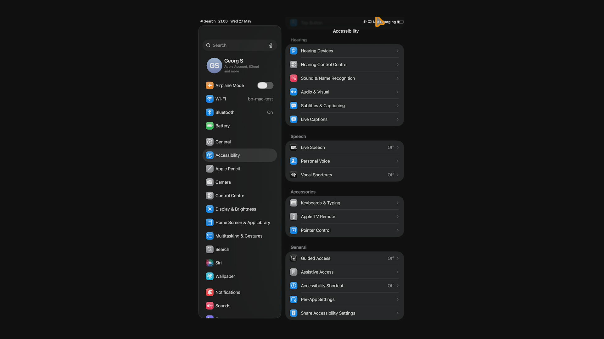
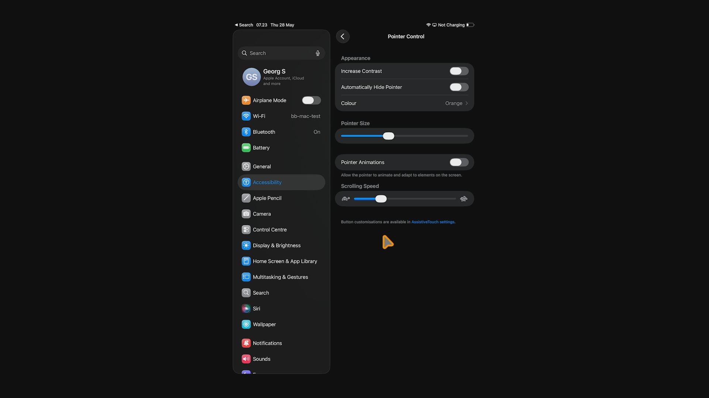
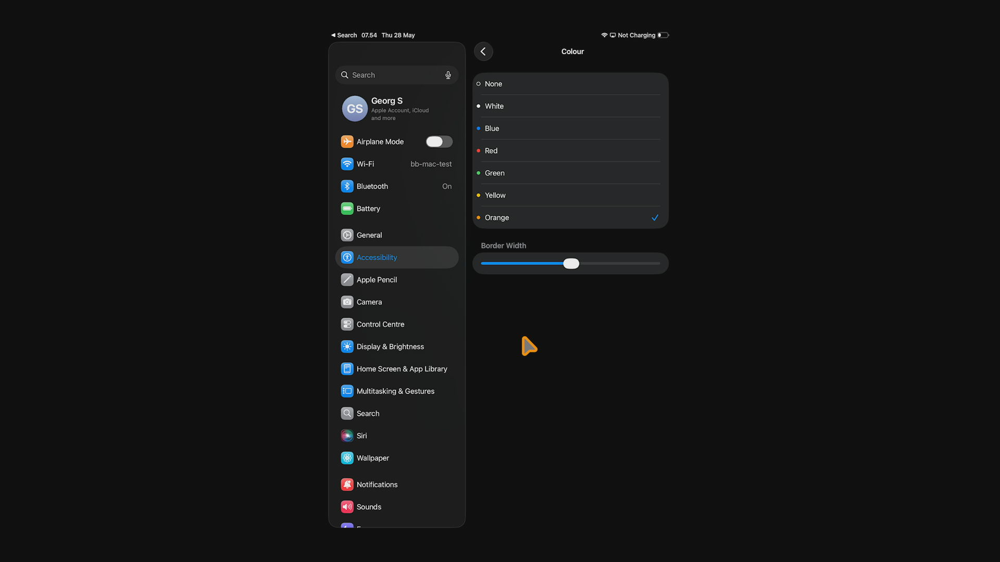

# PiKVM MCP Server


[](https://sonarcloud.io/summary/new_code?id=kultivator-consulting_pikvm_mcp_server)


[](https://lobehub.com/mcp/kultivatorconsulting-pikvm_mcp_server)


Give AI agents hands. This MCP server connects Claude Code (or any MCP client) directly to a [PiKVM](https://pikvm.org/) device, giving AI full keyboard, mouse, and screen access to a physical machine -- no browser automation, no virtual desktops, no emulators.

Point it at real hardware. Let the AI see the screen, type commands, click buttons, and navigate GUIs on a machine it could never otherwise touch.

<p align="center">
  
  <br>
  <em>A Raspberry Pi 5 controlled via PiKVM V4 Plus -- the AI's physical interface to the real world.</em>
</p>

### Automatic Mouse Calibration

IP-KVM devices translate mouse coordinates through multiple layers — USB HID emulation, host-side input drivers, display scaling — each introducing positional error. Existing KVM products either ignore this (requiring manual correction) or offer limited auto-sync that only detects cursor acceleration in a fixed corner region.

This MCP server takes a different approach. The `pikvm_auto_calibrate` tool uses a vision-based algorithm that:

1. **Moves the cursor** a known distance across multiple randomized screen positions
2. **Diffs screenshot pairs** to isolate the cursor via connected-component analysis
3. **Computes correction factors** from detected vs commanded movement using median aggregation
4. **Self-verifies** by moving to target positions and confirming the cursor lands within 20px

The entire process runs in ~30-60 seconds with no human intervention. Noisy screens (tooltips, animations, dynamic content) are handled through multi-round sampling, ratio divergence filtering, and outlier-resistant statistics — the algorithm discards bad data and still converges on accurate factors.

This is the first IP-KVM tooling — commercial or open source — to implement fully automated mouse coordinate calibration via computer vision. It is what makes precise AI-driven mouse control over a network KVM practical.

### See it in action

The video below shows Claude Code using this MCP server to autonomously interact with a Raspberry Pi desktop: taking a screenshot to identify the OS, opening a text editor from the menu, typing text, and closing the application -- all through the PiKVM hardware interface.

[](https://youtu.be/VYE8O1gAs7s)

This next demonstration shows Claude, connected via the PiKVM MCP server, responding to a natural language prompt to auto-calibrate its mouse coordinate scaling before performing a series of precision mouse tasks on a remote machine. The session concludes with Claude autonomously drawing a house in MS Paint — a simple but effective showcase of accurate, AI-driven input control over an isolated system.

[](https://youtu.be/kNj8TJD6odo)

## Features

- **Automatic mouse calibration** — Vision-based cursor detection computes coordinate correction factors with no manual measurement. The first fully automated calibration for IP-KVM.
- **Screenshot capture** — Get current screen as JPEG image
- **Text typing** — Type text with proper special character handling via keymaps
- **Keyboard control** — Send individual keys or key combinations (e.g., Ctrl+Alt+Delete)
- **Mouse control** — Move, click, and scroll with calibrated coordinate correction

## Installation

```bash
npm install
npm run build
```

### Nix / home-manager

A flake at the repo root packages the server reproducibly and exposes a home-manager module (`services.pikvm-mcp`) that installs it and reads the password from a file at runtime; you register it with Claude Code yourself via `claude mcp add`. See [`docs/nix.md`](docs/nix.md) (or [`nix/README.md`](nix/README.md) for the full guide).

## Configuration

Copy `.env.example` to `.env` and configure:

```bash
cp .env.example .env
```

Edit `.env`:
```
PIKVM_HOST=https://<your-pikvm-ip>
PIKVM_USERNAME=admin
PIKVM_PASSWORD=your_password
PIKVM_VERIFY_SSL=false
PIKVM_DEFAULT_KEYMAP=en-us
```

## iPad cursor configuration

If the target host is an iPad, **the iPadOS-side cursor settings strongly
affect click reliability**. With the configuration below, the
production click rate on 4 home-screen icons measured against
iPadCollector ground truth (taps recorded directly by a sidecar iPad
app, not inferred from screenshot diffs) is **~55–65 % HIT at N=80–320
trials** (see [docs/roadmap-2026-05-31.md § 6.6](docs/roadmap-2026-05-31.md)).
Per-target rate ranges from ~50 % (Files) to ~70 % (Settings).
Run-to-run swing at N=20–30 is ±10–15 pp.

The earlier figures of 85 % HIT (N=80 screenshot bench, 2026-05-31),
90 % HIT (N=20, 2026-05-28), and 93 % HIT (v11 ship-decision, 2026-05-30)
were all measured by the same screenshot-mediated detector that gates
the click — i.e., the detector both decides whether to click and
later evaluates whether the click "hit". The 2026-06-02 iPadCollector
ground-truth bench (§ 6.0) showed the screenshot bench overstates HIT
by ~30–40 pp because it counts gate-passing residual as success even
when the iPad never received the tap.

Without the cursor configuration the same bench measured ~10–50 % with
mixed silent failures.

Configure on the iPad once, before connecting it to the PiKVM HDMI capture:

**Settings → Accessibility → Pointer Control:**

| Setting | Value | Why |
|---|---|---|
| Increase Contrast | OFF | irrelevant for HDMI capture |
| **Automatically Hide Pointer** | **OFF** | the auto-fade after ~10 s breaks any session longer than that (Phase 256) |
| **Colour** | **Orange** | iOS rarely uses saturated orange in UI chrome, so the cursor's pixels are near-unique and the trained ML detector can find them reliably. White also works visually but collides with iOS chrome (Notes/Books/Airplane Mode all have white or orange-yellow icons that the cursor competes against) |
| **Border Width** | **~50% of slider** | the white outline around the coloured cursor body is what trains crisp ML features; thin border = ambiguous |
| **Pointer Size** | **~1/3 of slider** (one notch above smallest) | bigger cursor = bigger pixel cluster for detection. Above ~1/2 the cursor occludes UI and snaps to icons more aggressively |
| **Pointer Animations** | **OFF** | Phase 194-H's documented lever — magnetic snap-to-icon behaviour causes silent wrong-element clicks when cursor lands "almost on" target. With this OFF the cursor lands exactly where emitted |
| Scrolling Speed | any | unrelated |

**Settings → General → Trackpad & Mouse (if visible on your iPadOS version):**

| Setting | Value | Why |
|---|---|---|
| **Trackpad Inertia** | **OFF** | Phase 57 — inertia means a stopped emit still drifts the cursor; OFF makes positioning deterministic |

**Settings → Accessibility → Keyboard → Full Keyboard Access:**

| Setting | Value | Why |
|---|---|---|
| **Full Keyboard Access** | **ON** | Phase 63 — enables Tab / Arrow keyboard navigation in many panes. Keyboard nav is far more reliable than cursor clicks. With Full Keyboard Access OFF, only some apps respond to keyboard nav |

**ML cursor calibration is on by default.** When the bundled
`ml/cursor-v12.onnx` (8.7 MB, MobileNetV3-small, ~11 k training frames
= 1030 human-verified + 10 k iPad-app auto-labeled synthetic) is
present, the orange-cursor ML detector seeds the cursor-origin
calibration step automatically — no env vars required. Falls back to
v11 → v9-bordered → v8 if v12 isn't on disk.

An experimental `ml/cursor-v13.onnx` (v12 corpus + 100 4.1' on-icon
frames) exists — offline it's ~3 px tighter than v12 at p50 on the
34-frame on-icon held-out eval, but the live A/B (roadmap 4.3') has
not yet run, so v13 is **explicit opt-in only** via
`PIKVM_ML_V8_MODEL=ml/cursor-v13.onnx` and is deliberately excluded
from the auto-load candidate list.

To **disable** the ML path (force probe-and-diff only):
```bash
PIKVM_ML_DISABLE=1
```

To **A/B test** with a different model file:
```bash
PIKVM_ML_V8_MODEL=/absolute/path/to/some-other-model.onnx
```

### Screenshots

**Where Pointer Control lives** — Settings → Accessibility sidebar item, scroll down to **Accessories** in the right pane, **Pointer Control** is the last row:



**Pointer Control panel — all settings configured per the table above:**



Note the orange-bordered cursor at the bottom right — this is what the
v9-bordered model is trained to detect.

**Colour picker — Orange selected, Border Width at ~50%:**



### Why these settings exist as user-side levers

The iPad's HDMI mirror is a black-box pixel stream — we cannot inject
detection hooks or read pointer state. Every detector has to find a
small rendered cursor among ~2 million iOS UI pixels. The smaller and
less distinct the cursor, the harder the detection task. The orange +
border + size configuration **tilts the visual signal toward the
detector**, and the retrained ML model exploits that lift.

iPadOS's built-in pointer-animation / pointer-snap behaviour is the
other compounding factor — see Phase 194-H docs for why this isn't
something we can compensate for from the host side.

## Usage with Claude Code

> **Requires Node.js 18+.** This server uses ES modules. If `node --version` shows an older version, replace `"command": "node"` with the full path to a compatible binary (e.g. `"/usr/local/bin/node"` or your nvm path like `"~/.nvm/versions/node/v22.x.x/bin/node"`). This is common when nvm's default alias points to an older version.

Add to your Claude Code MCP settings (`~/.config/claude-code/settings.json` or via the settings UI):

```json
{
  "mcpServers": {
    "pikvm": {
      "command": "node",
      "args": ["/path/to/pikvm_mcp_server/dist/index.js"],
      "env": {
        "PIKVM_HOST": "https://<your-pikvm-ip>",
        "PIKVM_USERNAME": "admin",
        "PIKVM_PASSWORD": "your_password"
      }
    }
  }
}
```

Or if using the .env file:

```json
{
  "mcpServers": {
    "pikvm": {
      "command": "node",
      "args": ["/path/to/pikvm_mcp_server/dist/index.js"]
    }
  }
}
```

## Transports (stdio & HTTP)

The server speaks **stdio** by default (what Claude Code launches above). It can also serve the
modern **Streamable HTTP** transport for remote/networked clients:

```bash
# stdio (default)
node dist/index.js

# Streamable HTTP on 127.0.0.1:3000 (see --help for all flags)
node dist/index.js --transport http            # or the --http shorthand
node dist/index.js --http --host 0.0.0.0 --port 8080
```

| Flag | Env fallback | Default | Meaning |
|------|--------------|---------|---------|
| `--transport <stdio\|http>` | `PIKVM_MCP_TRANSPORT` | `stdio` | transport to serve |
| `--http` | — | — | shorthand for `--transport http` |
| `--host <addr>` | `PIKVM_MCP_HOST` | `127.0.0.1` | HTTP bind address |
| `--port <n>` | `PIKVM_MCP_PORT` | `3000` | HTTP port |
| `--target <ipad\|desktop\|auto>` | `PIKVM_TARGET` | `auto` | control path (see below) |
| `-h`, `--help` | — | — | show help and exit |

In HTTP mode the Streamable HTTP transport is served at `POST/GET/DELETE /mcp` (stateful: each
session is created by an `initialize` request and identified by the `Mcp-Session-Id` header), plus
a `GET /health` liveness check. CLI flags take precedence over the environment variables.

### Choosing the control path (`--target`)

The server has two movement/detection paths and picks one at startup:

- **`ipad`** — relative-mouse target: the deterministic **curve-one-shot** mover + the **cascade**
  cursor detector (the iPad path).
- **`desktop`** — absolute-mouse target: the legacy **detect-then-move** path (the original
  upstream project's auto-calibrate + template/shape detection).
- **`auto`** (default) — pick from the target's HID mouse mode at startup (relative → `ipad`,
  absolute → `desktop`).

Pass `--target ipad` or `--target desktop` to force it (or set `PIKVM_TARGET`). A forced choice
that disagrees with the detected HID mode logs a warning but is honored.

```bash
node dist/index.js --target ipad      # force the iPad path
node dist/index.js --target desktop   # force the desktop path
```

## Available Tools

### Diagnostics
- **`pikvm_version`** - Return the running server version. Use to detect a stale deployment: query this and compare against `main` (currently `0.5.40`).
- **`pikvm_health_check`** - One-call deployment health: server version + safety-guard state + **streamer source state (Phase 189: distinguishes "PiKVM down" from "device behind HDMI is off")** + live HID profile + iPad bounds detection + screen brightness. Run FIRST after deployment, AND when `pikvm_screenshot` returns 503 (Phase 190 enriches the error with a hint pointing here). Surfaces stale deployments, failed startup detection, source-side outages (e.g. iPad battery dead), and target-type mismatches.
- **`pikvm_hid_reset`** - Reset the PiKVM USB HID gadget when `pikvm_health_check` reports `mouse/keyboard online: false` and input has no effect. Sends `POST /api/hid/reset` (soft re-init). A soft reset cannot force the *host* to re-enumerate — if the target (e.g. an iPad that cold-booted from a dead battery) is not bringing the USB HID link up, `online` stays false and only a physical re-plug of the USB-C data cable, a target restart, **or a full PiKVM reboot** fixes it (live-verified 2026-07-19: a Pi reboot recreated the gadget and the iPad re-enumerated). Optional `reconnectUsb` toggles the OTG connection (no-op where the `connected` control is not wired).
- **`pikvm_screen_state`** - Cheap "is the screen on?" check (one `GET /streamer`). Returns `{ on, resolution }`. When `on: false` the HDMI source is dark (iPad locked/asleep/Touch-ID gate most often); `pikvm_screenshot` will 503 until the screen wakes. Cheaper than `pikvm_health_check` when you only need the on/off signal.

### Display
- **`pikvm_screenshot`** - Capture current screen as JPEG (optional: maxWidth, maxHeight, quality)
- **`pikvm_get_resolution`** - Get screen resolution and valid coordinate ranges

### Keyboard
- **`pikvm_type`** - Type text with keymap-aware special character handling (required: text; optional: keymap, slow, delay)
- **`pikvm_key`** - Send a key or key combo, e.g. Ctrl+Alt+Del (required: key; optional: modifiers, state)
- **`pikvm_shortcut`** - Send multiple keys pressed simultaneously (required: keys array)
- **`pikvm_dismiss_popup`** - Run the hidden-popup dismiss recipe (Escape → 60ms → Enter → 60ms). Useful when `click_at` returns success but the screenshot shows no UI change — the dominant explanation is an iOS HDMI-blocked security popup (Apple Pay / Face ID / password / Low Battery / app permission) eating the input. Live-verified twice on Low Battery modals (10% and 5% — both dismissed cleanly with one Escape). Best-effort, no required args.

### Mouse
- **`pikvm_mouse_move`** - Move cursor to absolute pixel position or relative delta (required: x, y; optional: relative)
- **`pikvm_mouse_click`** - Click a mouse button, optionally at a position (optional: button, x, y, state)
- **`pikvm_mouse_scroll`** - Scroll the mouse wheel (required: deltaY; optional: deltaX)

### Relative-Mouse Targets (iPad, etc. — `mouse.absolute=false`)

> **iPad usage — prefer keyboard workflows.** USB keyboard input on the
> iPad (Cmd+Space for Spotlight, Cmd+F for in-app search, plus typing) is
> far more reliable than cursor clicks because iPadOS pointer acceleration
> is non-disableable. See
> [docs/skills/ipad-keyboard-workflow.md](docs/skills/ipad-keyboard-workflow.md)
> for the recommended pattern. Use the cursor click tools below only for
> UI elements with no keyboard equivalent. iPad-side settings checklist:
> [docs/skills/ipad-setup.md](docs/skills/ipad-setup.md).

- **`pikvm_ipad_unlock`** - Unlock an iPad from lock screen. Phase 217 (v0.5.205): tries `Escape` + `Enter` + `Space` keys in sequence FIRST (Enter is the actual unlock on iPadOS 26 lock screens — Space alone stopped working between Phase 210's verification and 2026-05-10), then falls back to the legacy USB HID swipe-up. Default `dragPx` raised 800 → 1500 (Phase 209) for iPads with stricter swipe thresholds. Optional overrides: tryKeyPressFirst, slamFirst, startX, startY, dragPx, chunkMickeys.
- **`pikvm_ipad_launch_app`** - Launch any iPad app via the verified keyboard pipeline: unlock (if locked) → Spotlight (Cmd+Space) → type the app name → Enter. Far more reliable than clicking an app icon (required: appName). Verified on iPadOS 26 for Files, Settings, App Store.
- **`pikvm_ipad_lock`** - Lock the iPad by sending Ctrl+Cmd+Q (the macOS Lock Screen shortcut; honored on iPadOS 26). Screen turns off within ~2 s → `pikvm_screen_state` reports `on: false`. Mirror of the unlock tools.
- **`pikvm_ipad_unlock_with_code`** - Keyboard-only unlock for a passcode-protected iPad: Space → wait → Space → wait → type each digit → Enter (required: code). The `code` is sent verbatim to HID and is never logged, stored, or echoed in the response.
- **`pikvm_ipad_home`** - Return the iPad to the home screen from any foreground app via Cmd+H. Idempotent on the home screen. Phase 214 (v0.5.202): pass `forceHomeViaSwipe: true` when the iPad may be in App Switcher mode — Cmd+H alone does NOT dismiss the App Switcher; the additional slam-corner + upward swipe does. The swipe path also sends defensive Esc+Enter (Phase 231 v0.5.207, undoes accidental re-lock) and chunked Y emits to deposit cursor mid-screen (Phase 235 v0.5.208, fixes top-edge cursor pinning that blocked subsequent clicks to bottom-half targets).
- **`pikvm_ipad_app_switcher`** - Open the iPad App Switcher (Cmd+Tab) and capture a screenshot showing the available apps.
- **`pikvm_detect_orientation`** - Detect the iPad's content rectangle and orientation within the HDMI capture frame. Used internally by unlock and move-to; usually no need to call directly.
- **`pikvm_mouse_move_to`** - Approximate move-to-pixel on a relative-mouse target. Combines slam-to-origin (auto-detected per orientation), open-loop chunked deltas, motion-as-probe diff for live px/mickey, multi-pass closed-loop correction, and template-match fallback when motion-diff fails (required: x, y).
- **`pikvm_mouse_click_at`** - Approximate move + click on a relative-mouse target (required: x, y; optional: button).
- **`pikvm_measure_ballistics`** - Characterise the relative-mouse acceleration curve by slamming to a corner and sweeping (axis × magnitude × pace). Writes a JSON profile used by the move-to tools. *Best-effort on iPad home screen — use a quiet screen (Settings, lock screen) for cleaner data.*
- **`pikvm_seed_cursor_template`** - Bootstrap an initial cursor template for Phase 51 pre-click verification (Phase 58, v0.5.46+). Wakes the cursor with a small relative motion, diffs before/after to find it, persists a 24×24 template gated by `looksLikeCursor` (cohesion + brightness + saturation). Use ONCE after a fresh deployment or after clearing `data/cursor-templates/`. Subsequent clicks accumulate templates automatically.

**Cursor templates ship bundled** (Phase 284, 2026-05-12): 5 starter templates are committed under `data/cursor-templates/` so NCC (template-match, the primary cursor detector) works out of the box on fresh deployments. **Before Phase 284**, fresh deploys silently dropped to ~0% click rate because the cache was empty and there was no signal to the user that templates were missing (Phase 281 finding). If iPadOS updates the cursor rendering in a future release and click rates drop, manually re-run `pikvm_seed_cursor_template`. A future improvement (B2) would be an auto-refresh check on startup that detects stale templates and reseeds automatically.

**iPad click-accuracy expectations** (revised post-Phase 199, v0.5.194; honesty notes Phase 214/219/235/244, v0.5.211): with `maxRetries: 3` (iPad default — no opt-in needed) and the `maxResidualPx: 35` safety gate (also iPad default), end-to-end **correct-element click rates** are ~99% for sidebar rows, ~95-97% for app icons ≥100 px, ~88% for tiny back-arrows / X buttons / toggles. **For ~70 px small icons, ~5-15% correct-element hit + ~85-95% explicit "click skipped (residual too large)" errors + ~0% silent wrong-element clicks.** The earlier "~50-60% for small icons" figure was based on screen-changed checks that counted clicks landing on adjacent icons as hits; the production safety gate properly refuses those, so the real correct-element rate is much lower. **HONESTY NOTE (Phase 214/235/244, 2026-05-10):** prior measurements may have been taken with the iPad in App Switcher mode rather than home screen, because `pikvm_ipad_home` (Cmd+H) does NOT dismiss the App Switcher; only the `forceHomeViaSwipe: true` option does (Phase 235 v0.5.208 baked a chunked mid-screen cursor deposit into that path so subsequent clicks aren't blocked by top-edge pinning). Phase 244 (v0.5.211) extended the Phase 197 locality gate to the correction-pass — fewer confident-wrong template matches, more safe-null detections. **Phase 248/249 (v0.5.213/v0.5.214) shipped an opt-in `useKnownFpBlocklist: true` MCP arg that rejects 3 known iPad-UI false-positive locations. Phase 248 cumulative N=60 blocklist = 26.7% vs cumulative N=40 baseline = 30% within 35 px — blocklist actually slightly WORSE in aggregate, but both numbers within Phase 237 per-run variance (individual runs swing 5%→40% on identical protocol). The Phase 248 first-N=20 "40% with blocklist vs 25% baseline" suggested a 60% improvement; with more data the apparent improvement vanishes. The blocklist is semantically correct (rejects 3 visually-confirmed FPs) but no demonstrated click-rate benefit at this N. Motion-diff bypasses the blocklist (Phase 250+ candidate).** Per Phase 237's variance lesson, the rates above need an N≥30 re-bench before they should be trusted as current. To measure honestly, call `pikvm_ipad_unlock` then `pikvm_ipad_home({ forceHomeViaSwipe: true })` before each click bench. **For small iPad icons, use `pikvm_ipad_launch_app` (Spotlight + type + Enter) which is 100% reliable.** Toggling iPadOS Pointer Animations OFF (Settings → Accessibility → Touch → Pointer Control) is the user-side lever predicted to lift small-icon click rate to ≥ 90% — **verified live 2026-05-28 with the full cursor configuration in [§ iPad cursor configuration](#ipad-cursor-configuration): 90 % hit, 0 % miss on 4 targets × 5 trials**. Re-measured 2026-05-31 with the Stage 3.5 page-1 sanity gate at N=80: **85 % HIT, 0 % silent miss** — sits inside the same ±10 pp run-to-run band as the 2026-05-28 number. See `docs/troubleshooting/2026-04-30-phase-194h-disable-pointer-animations.md` (predicted) and `docs/troubleshooting/2026-05-28-orange-cursor-v9-bordered-90-percent.md` (measured). The iPad must be unlocked — call `pikvm_ipad_unlock` first or pass `autoUnlockOnDetectFail: true` for opt-in self-recovery. See `docs/troubleshooting/2026-05-10-phase-199-production-defaults-bench.md` for the production-bench methodology and `docs/troubleshooting/ipad-cursor-detection.md` § "Current state" for the full reliability matrix.

**v0.5.97+ template-match upgrade** (Phase 102-107): the cursor-template cache was 87.5% contaminated with letter-glyph false positives. Phase 106 fixed this with mask-based template extraction. Post-fix bench: cursor-verification rate 60-70% → **100%**, Phase 65 micro-step within-25-px hit rate **3/10 → 9/10** with median residual **6 px** (previously 36 px). Wrong-element-hit risk from stale template matches is materially reduced. **Restart your MCP client to activate** — see `docs/troubleshooting/ipad-cursor-detection.md` § "Phase 107 bench" for measurements.

### Absolute-Mouse Calibration (not applicable to iPad/relative-mouse targets)
- **`pikvm_auto_calibrate`** - Automatically detect cursor and compute calibration factors *(preferred)*
- **`pikvm_calibrate`** - Start manual calibration by moving cursor to screen center for visual verification
- **`pikvm_set_calibration`** - Apply correction factors calculated from calibration (required: factorX, factorY)
- **`pikvm_get_calibration`** - Get current calibration state
- **`pikvm_clear_calibration`** - Reset to uncalibrated mode

## Skills (Prompts & Skill Tools)

The server exposes structured guidance for agents via skills. Each skill is available via **two discovery paths**:

- **MCP Prompts** — `prompts/list` / `prompts/get` for clients that support the Prompts capability.
- **Skill Tools** — `tools/list` / `tools/call` as `skill_*` read-only tools, ensuring visibility in marketplaces (e.g. LobeHub) that index tools only.

### Tool Guides

| Prompt Name | Skill Tool | Description |
|---|---|---|
| `take-screenshot` | `skill_take_screenshot` | Capturing screenshots with pikvm_screenshot |
| `check-resolution` | `skill_check_resolution` | Checking screen resolution with pikvm_get_resolution |
| `type-text` | `skill_type_text` | Typing text with pikvm_type |
| `send-key` | `skill_send_key` | Sending keys with pikvm_key |
| `send-shortcut` | `skill_send_shortcut` | Sending keyboard shortcuts with pikvm_shortcut |
| `move-mouse` | `skill_move_mouse` | Moving the mouse with pikvm_mouse_move |
| `click-element` | `skill_click_element` | Clicking with pikvm_mouse_click |
| `scroll-page` | `skill_scroll_page` | Scrolling with pikvm_mouse_scroll |
| `auto-calibrate` | `skill_auto_calibrate` | Automatic mouse calibration with pikvm_auto_calibrate |
| `ipad-unlock` | `skill_ipad_unlock` | Unlocking iPad lock screen with pikvm_ipad_unlock |
| `detect-orientation` | `skill_detect_orientation` | Detecting iPad bounds and orientation with pikvm_detect_orientation |
| `measure-ballistics` | `skill_measure_ballistics` | Characterising relative-mouse ballistics with pikvm_measure_ballistics |
| `move-to` | `skill_move_to` | Approximate move-to-pixel with pikvm_mouse_move_to |
| `click-at` | `skill_click_at` | Approximate click-at-pixel with pikvm_mouse_click_at |

### Workflow Recipes

| Prompt Name | Skill Tool | Arguments | Description |
|---|---|---|---|
| `setup-session-workflow` | `skill_setup_session_workflow` | — | Initialize a PiKVM session |
| `calibrate-mouse-workflow` | `skill_calibrate_mouse_workflow` | — | Calibrate mouse coordinates |
| `click-ui-element-workflow` | `skill_click_ui_element_workflow` | `element_description` (required) | Find and click a UI element |
| `fill-form-workflow` | `skill_fill_form_workflow` | `form_description` (optional) | Fill in a form on screen |
| `ipad-keyboard-first-workflow` | `skill_ipad_keyboard_first_workflow` | `goal` (required) | Reliable keyboard-first iPad workflow (live-validated; bypasses cursor) |
| `navigate-desktop-workflow` | `skill_navigate_desktop_workflow` | `goal` (required) | Navigate a desktop environment |
| `auto-calibrate-mouse-workflow` | `skill_auto_calibrate_mouse_workflow` | — | Automatic mouse calibration |

See [`docs/skills/`](docs/skills/) for detailed human-readable guides.

## Key Codes Reference

Common key codes for `pikvm_key` and `pikvm_shortcut`:

- Letters: `KeyA`, `KeyB`, ... `KeyZ`
- Numbers: `Digit0`, `Digit1`, ... `Digit9`
- Function keys: `F1`, `F2`, ... `F12`
- Modifiers: `ShiftLeft`, `ShiftRight`, `ControlLeft`, `ControlRight`, `AltLeft`, `AltRight`, `MetaLeft`, `MetaRight`
- Special: `Enter`, `Escape`, `Backspace`, `Tab`, `Space`, `Delete`, `Insert`, `Home`, `End`, `PageUp`, `PageDown`
- Arrows: `ArrowUp`, `ArrowDown`, `ArrowLeft`, `ArrowRight`

## iPad data-collection pipeline

A SwiftUI iPad app paired with two Mac-side benches auto-labels cursor positions for training data. The iPad renders the cursor in a known scene and reports its on-screen coordinates back to the Mac over WebSocket; the bench saves a screenshot + label per frame. No human labelling is required.

Three components make up the pipeline:

- [`ipad-collector/`](ipad-collector/) — the SwiftUI app that runs on the iPad. See [`ipad-collector/SETUP.md`](ipad-collector/SETUP.md) for build and provisioning. Once the app is running, type **help** on the connected USB keyboard to open the settings sheet (scene picker, target Mac host, port).
- [`benches/bench-collect-synthetic.ts`](benches/bench-collect-synthetic.ts) — per-frame request/response collector. The bench asks the app to render a scene and effect, takes a PiKVM screenshot, and saves the frame with the cursor-label JSON the app returns. Used for cursor-detector training data.
- [`benches/bench-collect-trajectory.ts`](benches/bench-collect-trajectory.ts) — streaming-mode collector. The bench emits HID mouse deltas while the app streams the rendered cursor position back continuously, producing emit→cursor pairs for fitting the pointer-acceleration model.

Quickstart (iPad app must be running and connected to the same network):

```
# iPad app must be running and connected
npx tsx benches/bench-collect-synthetic.ts --target 100   # 100 labeled frames
npx tsx benches/bench-collect-trajectory.ts                # pointer-accel data
```

The collected datasets feed two trainers:

- [`ml/train-cursor-v12.py`](ml/train-cursor-v12.py) — trains the next cursor detector on the synthetic dataset combined with prior human-verified frames.
- [`ml/train-pointer-accel.py`](ml/train-pointer-accel.py) — fits the emit→displacement model used by `pikvm_mouse_move_to` for closed-loop correction.

The WebSocket protocol runs on port **8767**. The Mac-side collector listens on `0.0.0.0:8767`; the iPad app connects out to the Mac's LAN address at that port.

## License

GPL-3.0 - See [LICENSE](LICENSE) for details.
